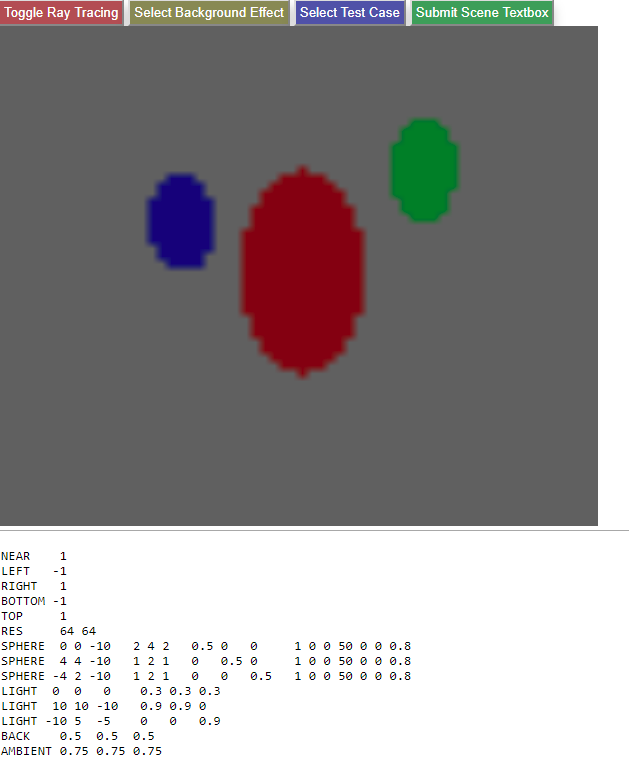
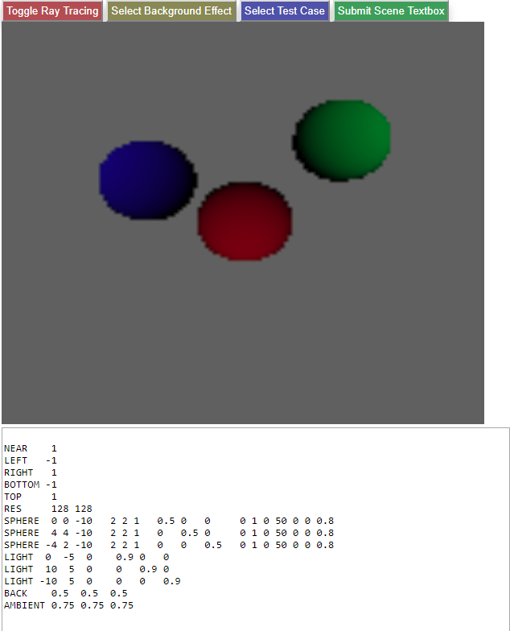
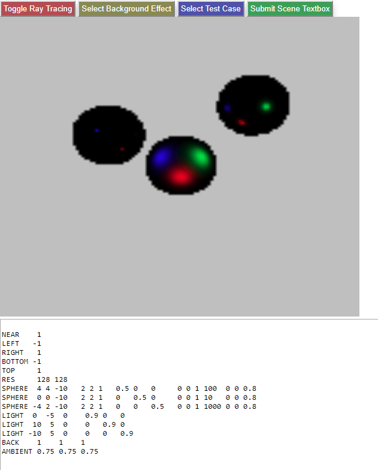
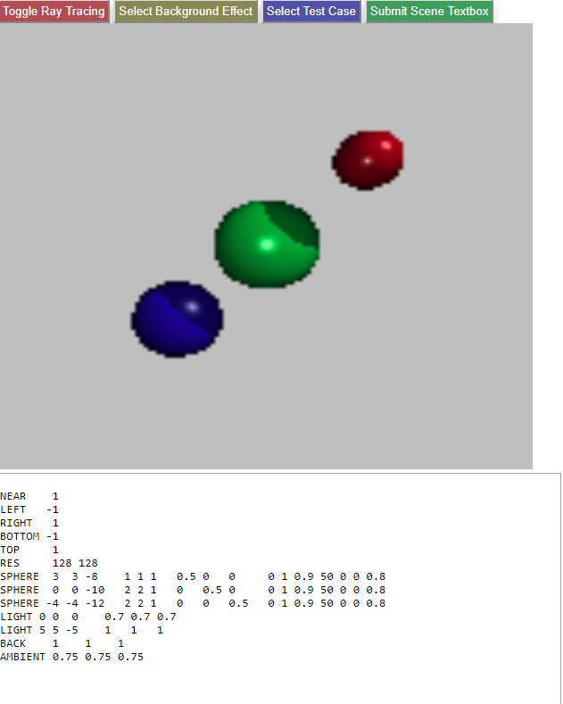
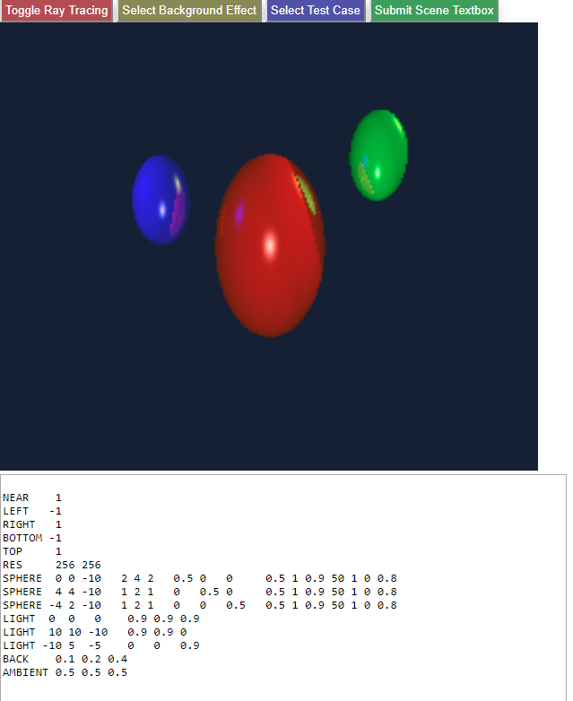
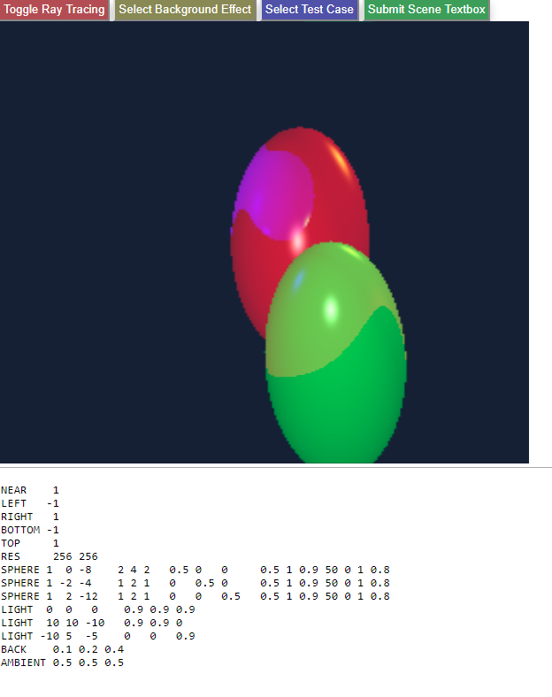

# ray-tracer
Codes to implement ray tracer.

Download the whole file and open the ray_teacer.html in a web browser. 

Recommend to use Firefox, but Chrome should be fine, too.

Ambient:

Diffuse:

Specular:

Shadow:

Reflection:

Refraction:

